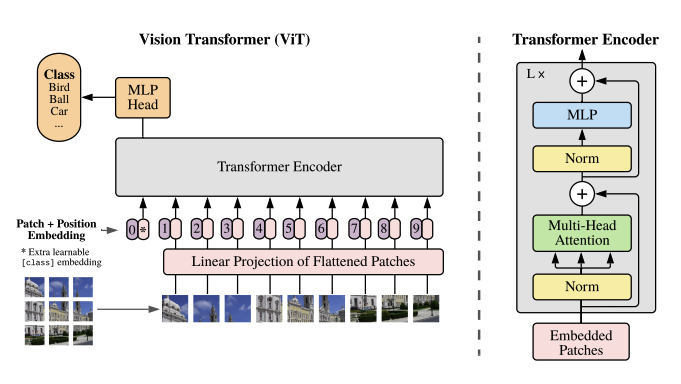
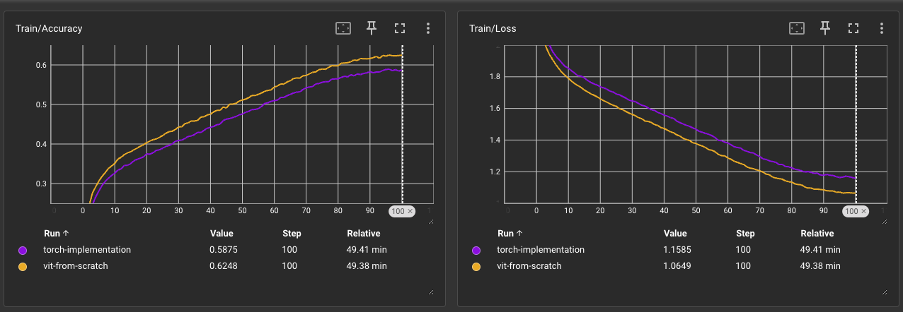
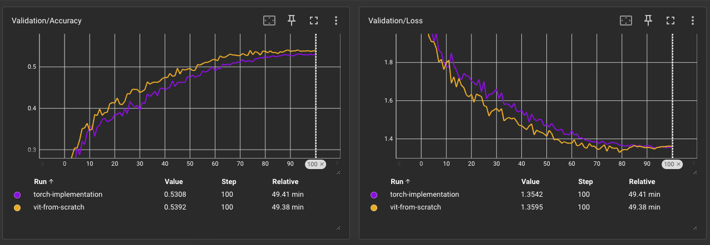

# Vision Transformer From Scratch



A PyTorch implementation of the [Vision Transformer](https://arxiv.org/pdf/2010.11929) (**An Image is Worth 16x16 Words: Transformers for Image Recognition at Scale**)

## Objective

To create the Vision Transformer from scratch and validate its performance against the official PyTorch implementation, I trained both the ViT-b/16 model from the PyTorch implementation and my scratch-built Vision Transformer on CIFAR-10 without using any pre-trained weights.

The performance of the two models was then evaluated to verify the accuracy of my implementation.

Note: The CIFAR-10 test set was used as a validation set solely for the purpose of verifying the implementation's accuracy.

## CIFAR-10 Test Results

| Implementation | Loss   | Accuracy   |
|----------------|--------|------------|
| From Scratch   | 1.3595 | **53.92%** |
| PyTorch        | 1.3542 | **53.08%** |

## Repository Contents

This repository contains constructors for:

| Model      | Layers | Hidden size D | MLP size | Heads | Params |
|------------|--------|---------------|----------|-------|--------|
| ViT-Base   | 12     | 768           | 3072     | 12    | 86M    |
| ViT-Large  | 24     | 1024          | 4096     | 16    | 307M   |
| ViT-Huge   | 32     | 1280          | 5120     | 16    | 632M   |

## Installation

```bash
# install required dependencies
pip install -r requirements.txt
```

## Navigate to Source Directory

```bash
cd src/
```

## Configuration

Configure model through `train_config.yaml` found under the **config** directory. An example configuration is shown below:

``` yaml
# Training
seed: 42
epochs: 100
batch_size: 256
eta_min: 1.0e-6
learning_rate: 1.0e-4

# Regularization
weight_decay: 0.0
label_smoothing: 0.0
dropout_probability: 0.0
apply_augmentation: True

# Model
img_size: 32
variant: base
patch_size: 16
num_classes: 10
learnable_pe: True
torch_implementation: True
```

## Training

To train the model, run the following under the `src/` directory.

```bash
python main.py
```

## Graphs

### Train



### Validation

